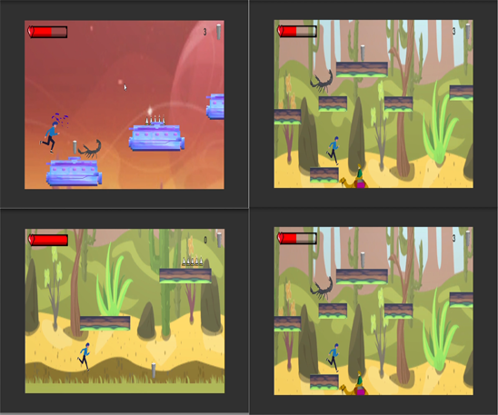

# Border
* A game implement for a basic AI implementation with Unity C#
* A 2D platformer based game made just for implementing a basic AI script.

# Link : 
https://drive.google.com/drive/folders/1LvJVWlxzY8R1TE7QV3dK2H_r47T9cspT?usp=sharing

* Link contains the game project.
* Video preview of the game.

# Screenshot : 

# Aim
To implement a Universal basic AI controller script for any 2D platformer on C#.
* Enemy can shoot.
* Walk towards the player.

# System Requirements
* Windows 10 pro
* Unity 2018(LTS)
* Visual Studios 17 or above
* Core i5 processors 7th gen or above.
* Dedicated GPU (Nvidia or AMD) Recomended.

# Getting Started
Start by downloading the project from given link at the bottom.
Unity 2018 with (LTS) recomended.

* Visual Studio 2019 or 2019 is recommended, It is made to run on Windows OS (8,10).
* Unity 2018(LTS) is recomended.
* Basics of C# language.
* Knowledge on ray tracing with unity.

# Main features to come:
* Enemy can turn around.

